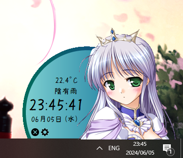
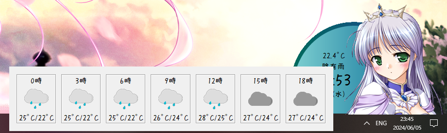

# Waifu Clock

Waifu clock is designed for gamers and anyone using full-screen applications. It ensures that you always have access to the time, even when the original Windows clock is obscured by objects like drinks or books in front of your second monitor.




## Weather Forecast

Hover over the weather information for more than 1 second to display a detailed forecast popup.




## Installation

```
git clone https://github.com/B10715041/Waifu-Clock.git
pip install -r requirements.txt
```

**Voice Pack Support**: Enhance your experience with downloadable [voice packs](https://github.com/B10715041/Waifu-Clock/releases/tag/VociePack).
Extract the voice pack into the root directory of the project:

```
.
├── audios
│   └── voice
└── images
    ├── chara
    │   ├── cynthia
    │   ├── erika
    │   ├── estel
    │   ├── feena
    │   ├── fiacca
    │   ├── hina
    │   ├── karen
    │   ├── kaya
    │   ├── kiriha
    │   ├── mai
    │   ├── natsuki
    │   ├── sayaka
    │   ├── siro
    │   └── wreath
    └── weather icons
```

## Usage Tip

- **Running Without a Console Window**: To run the application without a console window appearing, use `pythonw.exe` instead of `python.exe`. This is particularly useful for a seamless user experience in GUI applications.

